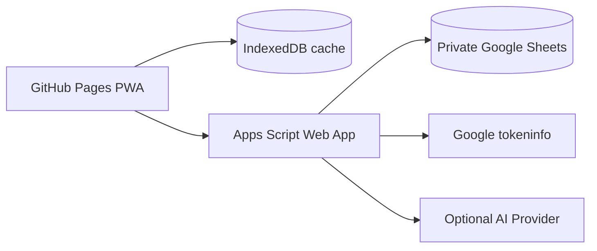

# Architecture

Songbook is a static PWA plus Apps Script backend.

## Frontend

- React, TypeScript, Vite, React Router.
- `BrowserRouter` uses `/songbook/` basename.
- `vite-plugin-pwa` generates the service worker and manifest.
- Dexie stores public snapshots and offline performance queue items.

## Backend

- Apps Script exposes a single Web App with action-routed `doGet`/`doPost`.
- Read-only public data does not require login.
- Writes require Google ID token verification and allowlist role checks.
- Sheets are accessed with header maps, `getValues()`, `setValues()`, versions, and `LockService`.

